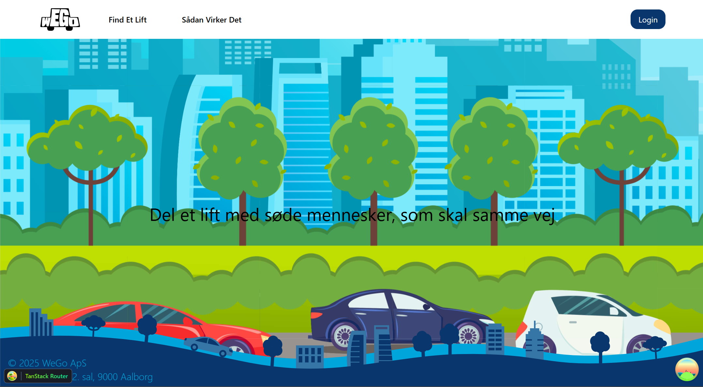
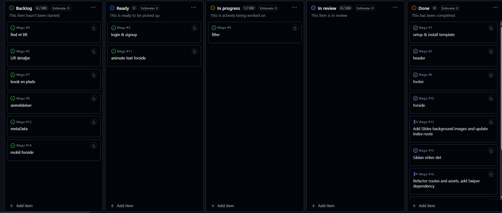

# Wego

## William leander jensen - H1WE080124

**Repo - <https://github.com/willy0483/Wego>**

**Brugernavn** - info@webudvikler.dk

**Adgangskode** - password

## Indholdsfortegnelse

1. Vurdering af egen indsats og gennemførelse

2. Argumentation for de valg du har truffet under løsningen af opgaven

3. Redegørelse af de forskellige kodeelementer i prøven

4. Fremhævelse af punkter til bedømmelse

5. Bilag

### Vurdering af egen indsats og gennemførelse

jeg startede med at læse opgaven igennem og lave issues og så satte jeg min template op med backend og derefter gik jeg i gang med min issues som header footer og forside har haft nogen småproblemer med style og images

### Argumentation for de valg du har truffet under løsningen af opgaven

Jeg har ændret designet på login så den har sin egen side og det samme gælder signup.Mobilnav har dog ikke helt den samme stil men næsten

### Redegørelse af de forskellige kodeelementer i prøven

Jeg har bruge shadcn og tailwind til nogen komponter <https://ui.shadcn.com/docs> kan ogsp see i ui mappe

jeg har bruge swiperjs til at lave silder
<https://swiperjs.com/>

### Fremhævelse af punkter til bedømmelse

jeg vil gerne fortælle om hvorfor jeg har brugt tanstack og nogen af de ting den kan og med dens dev tools og cache

### Bilag

### Day1

